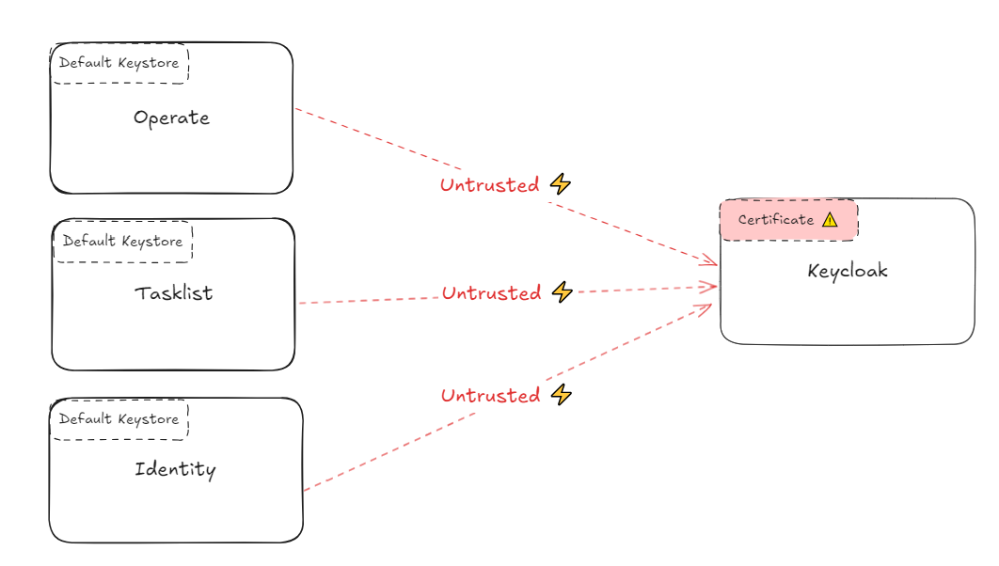
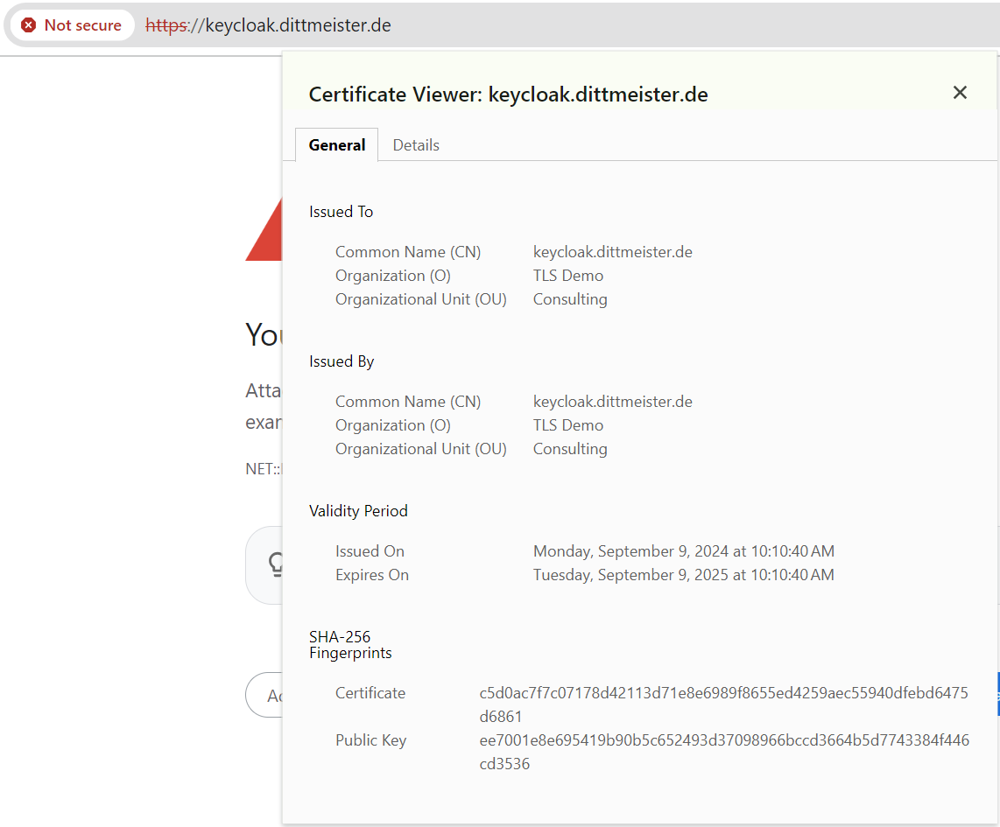
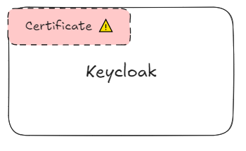
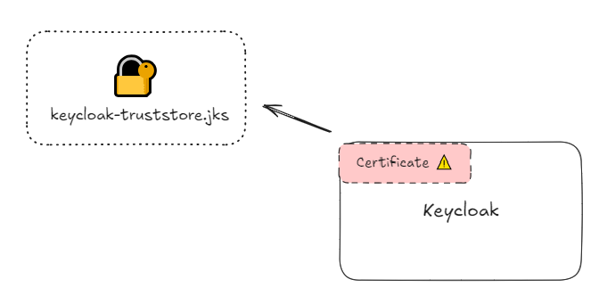
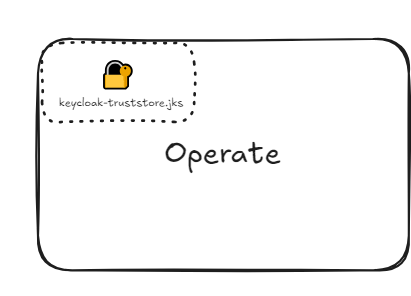
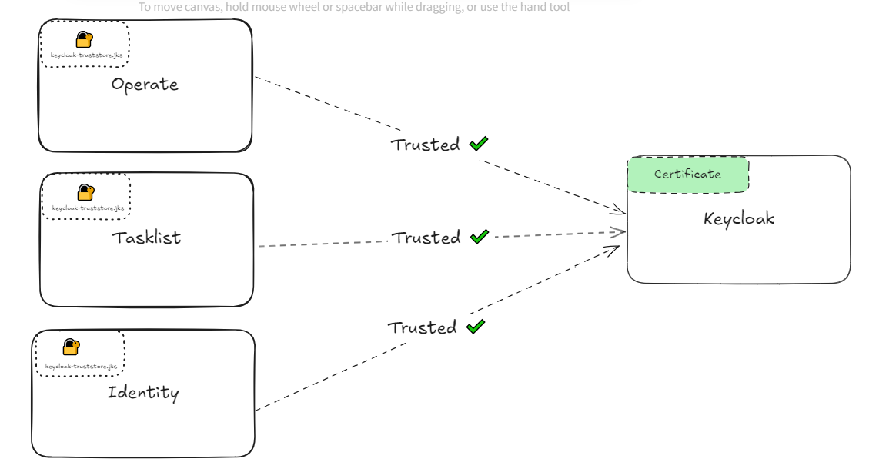

## Setup

In the current setup, the Operate, Tasklist, and Identity services are using the default Java keystore (cacerts). However, the Keycloak instance is configured with a custom certificate that is not trusted by these services. 

This untrusted connection is due to the fact that the default keystore does not include the custom certificate used by Keycloak. Without establishing trust, secure communication between the services and Keycloak is not possible.

To resolve this issue, the custom certificate from Keycloak must be added to the default keystore (or a custom keystore should be provided) for each service to trust the Keycloak certificate.




## Demo Setup

### Install Keycloak with custom certificate

To create a self-signed certificate and use it in your Keycloak deployment via Helm, follow these step-by-step instructions. The process involves creating the certificate, configuring your Keycloak Helm deployment, and applying the changes.

#### Step 1: Generate a Self-Signed Certificate
Use OpenSSL to generate a private key and self-signed certificate. Open a terminal and run the following commands:

```
# Create a private key
openssl genrsa -out keycloak.key 2048

# Generate a self-signed certificate (valid for 365 days)
openssl req -new -x509 -key keycloak.key -out keycloak.crt -days 365 \
-subj "/C=DE/ST=Berlin/L=Berlin/O=TLS Demo/OU=Consulting/CN=keycloak.example.de/emailAddress=consulting@example.com"
```

This will create two files: keycloak.key (private key) and keycloak.crt (self-signed certificate).

#### Step 2: Create a Kubernetes Secret for the TLS Certificate

Create a Kubernetes secret to store the self-signed certificate and private key. This secret will be used by the Nginx ingress controller to enable TLS.

```
kubectl create secret tls keycloak-tls \
  --cert=keycloak.crt --key=keycloak.key
```
This command creates a secret named keycloak-tls with the certificate and key you just generated.

#### Step 3: Update values.yaml for Keycloak Helm Deployment

```
...
ingress:
...
  tls: true
  extraTls:
    - hosts:
        - keycloak.example.de
      secretName: keycloak-tls
...
```

#### Step 4: Install Keycloak


```
helm install keycloak oci://registry-1.docker.io/bitnamicharts/keycloak -f keycloak-values.yaml --version 19.4.1
```

#### Step 5: Validate in Browser and Terminal



```
openssl s_client -connect keycloak.example.de:443 -showcerts
```

Output:
```
openssl s_client -connect keycloak.example.de:443 -showcerts
CONNECTED(00000003)
depth=0 C = DE, ST = Berlin, L = Berlin, O = TLS Demo, OU = Consulting, CN = keycloak.example.de, emailAddress = consulting@example.com
verify error:num=18:self-signed certificate
verify return:1
```



### Install Camunda with External Keycloak

```
kubectl create secret generic keycloak --from-literal=admin-password=admin
```

```
helm install camunda camunda/camunda-platform -f camunda-values.yaml --version 10.3.2
```

e.g. Operate Logs
```
Caused by: sun.security.provider.certpath.SunCertPathBuilderException: unable to find valid certification path to requested target
 ```

 

 ## Mount Custom Keystores

 ### Create Keystore

 You need to create a Java keystore (truststore) to include the Keycloak certificate so that the Camunda Components can trust.


#### Step 1: Convert the Self-Signed Certificate into a Java Truststore using the keytool command

```
  keytool -importcert -file keycloak.crt -alias keycloak-cert -keystore keycloak-truststore.jks -storepass changeit
```

```
Trust this certificate? [no]:  y
Certificate was added to keystore
```



#### Step 2: Create a Kubernetes Secret to Hold the Truststore

Next, you need to create a Kubernetes secret that contains the truststore (keycloak-truststore.jks) so that your Helm-deployed Components can use it.

```
kubectl create secret generic keycloak-truststore \
  --from-file=keycloak-truststore.jks
```

#### Step 3: Mount the Truststore in Your Helm Deployment

Now, update your Helm chart's values.yaml to mount the truststore secret into the Java applications.

Example for Operate:
```
operate:
  env:
    - name: JAVA_TOOL_OPTIONS
      value: "-Djavax.net.ssl.trustStore=/etc/ssl/certs/keycloak-truststore.jks -Djavax.net.ssl.trustStorePassword=changeit"
  extraVolumes:
    - name: truststore-volume
      secret:
        secretName: keycloak-truststore
  extraVolumeMounts:
    - name: truststore-volume
      mountPath: /etc/ssl/certs/keycloak-truststore.jks
      subPath: keycloak-truststore.jks
```

   

Find the rest in [camunda-values-certs.yaml](camunda-values-certs.yaml)

#### Step 4: Upgrade Helm Deployment
```
export CONSOLE_SECRET=$(kubectl get secret "camunda-console-identity-secret" -o jsonpath="{.data.console-secret}" | base64 --decode)
export TASKLIST_SECRET=$(kubectl get secret "camunda-tasklist-identity-secret" -o jsonpath="{.data.tasklist-secret}" | base64 --decode)
export OPTIMIZE_SECRET=$(kubectl get secret "camunda-optimize-identity-secret" -o jsonpath="{.data.optimize-secret}" | base64 --decode)
export OPERATE_SECRET=$(kubectl get secret "camunda-operate-identity-secret" -o jsonpath="{.data.operate-secret}" | base64 --decode)
export CONNECTORS_SECRET=$(kubectl get secret "camunda-connectors-identity-secret" -o jsonpath="{.data.connectors-secret}" | base64 --decode)
export ZEEBE_SECRET=$(kubectl get secret "camunda-zeebe-identity-secret" -o jsonpath="{.data.zeebe-secret}" | base64 --decode)
```

```
helm upgrade camunda camunda/camunda-platform -f camunda-values-certs.yaml --version 10.3.2
```



**Note:** The diagram is a simplification. You must mount the keystore to every component that communicates with Identity (including Optimize, Zeebe, Connectors, and Modeler).

# Special Cases

## What if i don't have the keycloak.crt?

### Option 1: Using openssl to Retrieve the Certificate from the Server
You can use openssl to connect to the Keycloak server, download the certificate, and save it as a .crt file.

#### Step 1: Use openssl to Extract the Certificate
Run the following command to retrieve the certificate from Keycloak:

```
openssl s_client -connect keycloak.example.de:443 -showcerts </dev/null 2>/dev/null | openssl x509 -outform PEM > keycloak.crt
```
This command will:

Connect to the Keycloak server (keycloak.example.de) on port 443.
Retrieve the certificate and output it in PEM format.
Save the certificate to keycloak.crt.
Step 2: Verify the Certificate
You can check the content of the certificate using the openssl x509 command:

```
openssl x509 -in keycloak.crt -text -noout
```
This will display details of the certificate such as the issuer, subject, validity, and fingerprints.

### Option 2: Using wget to Retrieve the Certificate (if openssl is not available)
If openssl is not available, you can also extract the certificate from the server using wget or curl.

Step 1: Retrieve the Certificate with wget
Use wget to retrieve the certificate and display the server's certificate chain:

```
wget --no-check-certificate --server-response --output-document=/dev/null https://keycloak.example.de
```
Unfortunately, wget doesn’t directly save the certificate, but this command allows you to inspect the certificate chain in the response.

### Option 3: Retrieving the Certificate via Browser (Manual Method)
You can manually retrieve the certificate from your browser if you're accessing the Keycloak server through a browser (e.g., Chrome, Firefox).

Chrome/Firefox Instructions:
Open the Keycloak URL (https://keycloak.example.de) in your browser.
Click on the padlock icon in the address bar.

Click View Certificate or Certificate (Valid) (depending on the browser).

In the certificate details, click Export or Save (depending on your browser).
Save the certificate as keycloak.crt.
### Option 4: Use Java's keytool to Directly Import the Certificate from the Server
Java's keytool utility can directly import a certificate from a server into a truststore.

#### Step 1: Import the Certificate Directly into Truststore
You can directly import the certificate from Keycloak into a new truststore using keytool:

```
keytool -printcert -sslserver keycloak.example.de:443 -rfc > keycloak.crt
```
This command will fetch the certificate from keycloak.example.de and save it to a file called keycloak.crt.

#### Step 2: Import the Certificate into the Truststore
Now, import the certificate into your truststore:

```
keytool -importcert -file keycloak.crt -alias keycloak-cert -keystore keycloak-truststore.jks -storepass changeit
```

This will import the certificate into your Java truststore.

#### Step 3: Verify the Truststore
Once the certificate is imported, list the contents of the truststore to verify the certificate is present:

```
keytool -list -v -keystore keycloak-truststore.jks -storepass changeit
```

#### Final Steps: Apply the Truststore in Your Application
Once the certificate is imported into your truststore (keycloak-truststore.jks), proceed with mounting the truststore in your Helm chart and configuring Camunda Components to use it.